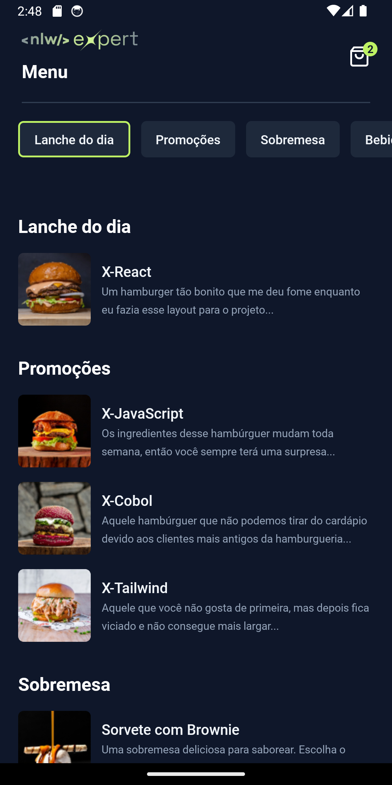
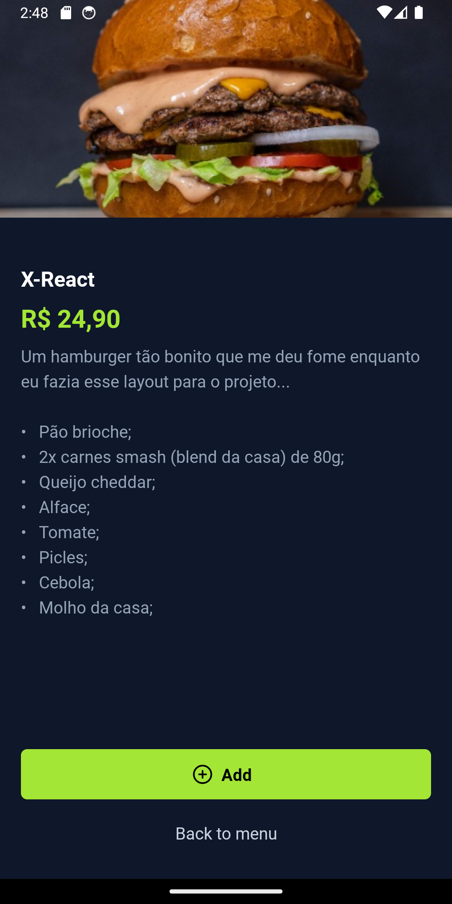
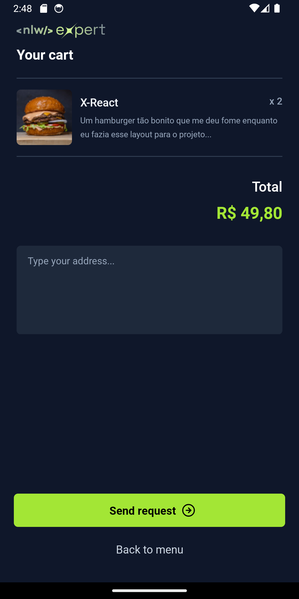

# NLW Expert Burguer App


**NLW Expert Burguer App** is a simple go-to burguer. This project was developed as part of a hands-on session during the React Native in Practice event (Rocketseat), leveraging Expo for streamlined cross-platform development.

## Credits

This project was developed based on the knowledge acquired through courses and educational materials provided by [rocketseat](https://www.rocketseat.com.br). Rockseat offers a wide range of high-quality courses and content for developers in various areas, including design, programming, and app development.

We would like to thank the Rockseat team for providing valuable educational resources that contributed to the development of this project.

For more information about the courses and materials offered by Rockseat, please visit the official website at [rocketseat](https://www.rocketseat.com.br).

## Technology

The following are the key technologies and tools used in the development of this app:

- **React Native**: It's a mobile app development framework that allows you to build native apps for iOS and Android using JavaScript and React. It enables mobile app development with a single codebase, providing a native user experience.
- **Expo**: It's an open-source platform and set of tools for building native mobile apps using JavaScript and React Native. Expo provides a range of ready-to-use components and APIs that streamline app development, including access to features like camera, geolocation, and push notifications.
- **Expo Router**: The Expo router is not a standalone library or module, but rather a part of the Expo SDK that facilitates navigation between screens in React Native apps built with Expo. It provides a simplified and declarative way to manage navigation within an app, allowing developers to define routes and navigate between them using components like StackNavigator, TabNavigator, and DrawerNavigator.
- **Nativewind**: NativeWind uses Tailwind CSS as scripting language to create a universal style system for React Native. NativeWind components can be shared between platforms and will output their styles as CSS StyleSheet on web and StyleSheet.create for native.
- **Zustand**: A small, fast and scalable bearbones state-management solution using simplified flux principles. Has a comfy API based on hooks, isn't boilerplatey or opinionated.
- **React Native Async Storage**: AsyncStorage allows applications to efficiently save data locally and access that data in future sessions.
- **Clsx**: Is generally used to conditionally apply a given className

## How It Works

**NLW Export Burguer** is your go-to burger ordering platform. Browse the menu, select your favorite burger, add it to your cart, and check out with ease. Finalize your order, and it's sent to WhatsApp for a seamless test order experience.

### Home

The home screen of our NLW Expert Burguer App features a mouthwatering menu of burgers, neatly categorized into sections like "Burger of the Day," "Promotions," "Desserts," and "Beverages." Users can easily navigate through these sections using a convenient filter option, allowing them to scroll directly to their desired category. Each burger option is presented as a clickable button, enticing users to explore further by redirecting them to the detailed order page.

### Burguer details

The Burger Details screen, users are presented with a comprehensive overview of the selected burger, including detailed information such as ingredients, size options, and pricing. Additionally, a prominent "Add to Cart" button allows users to effortlessly add the burger to their order.

### Cart

The Cart screen, users can review all the burgers added to their order, along with a summary of the total purchase amount. Additionally, there is a convenient field for users to input their address for delivery. At the bottom of the screen, a prominent "Checkout" button allows users to finalize their purchase. Upon clicking this button, the order details are automatically sent to a test WhatsApp number.

## Screenshots

### Home



### Burguer details



### Cart



## Installation

To run the app locally, follow these steps:

1. Clone the repository:

   ```bash
   git clone https://github.com/edsoncamargo/my-goals-app
   cd your-path/my-goals-app
   ```

2. Install the dependencies:

   ```bash
   npm install
   ```

3. Start the app:

   ```bash
   npx expo start
   ```

4. Scan the QR code using the Expo Go app on your mobile device or use an emulator to test the app.

## Contribution

You are welcome to contribute to the development of this project. If you find bugs, wish to add new features, or improve usability, feel free to open an issue or submit a pull request.

## Contact

- Name: Edson Camargo Menezes
- Email: contact@edsoncamargo.dev

## Acknowledgments

Special thanks to everyone who contributed to making this app a reality, especially Rocketseat for their invaluable support and guidance throughout the development process. Your expertise and dedication have been instrumental in bringing this project to fruition.

Enjoy using **NLW Expert Burguer App!**
